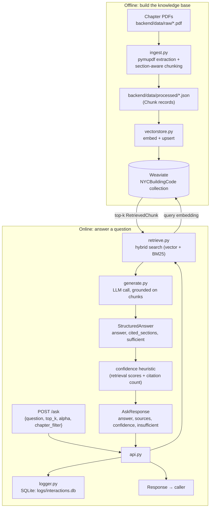
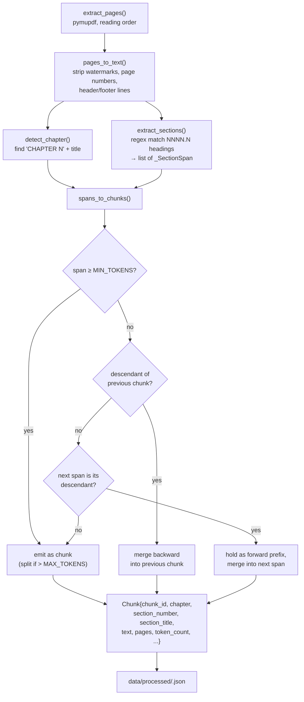
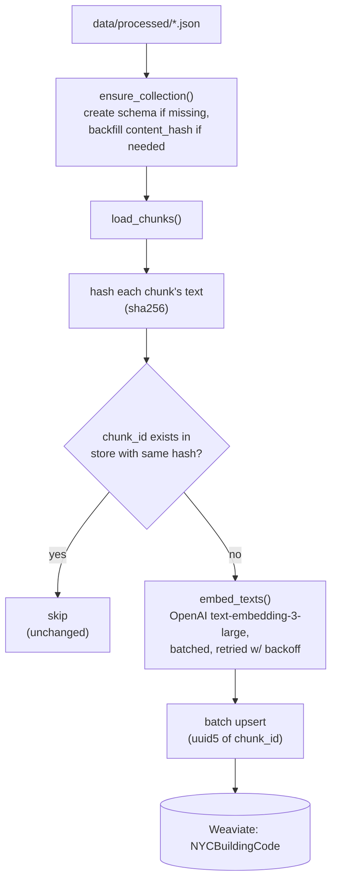
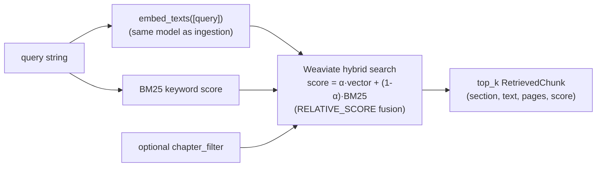
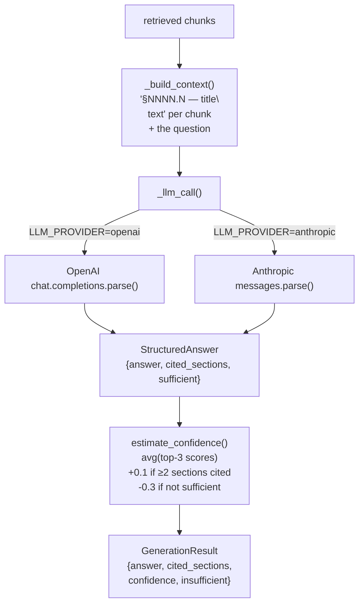
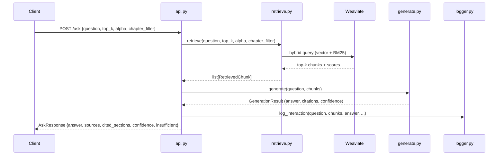

# Backend

FastAPI + RAG pipeline for the NYC Building Code chatbot. Six scripts, each
one phase of the pipeline, run in this order:

```
ingest.py  →  vectorstore.py  →  retrieve.py  →  generate.py  →  api.py  →  logger.py
(offline, run once)  (offline)      (online, per-request)                 (per-request)
```

`ingest.py` and `vectorstore.py` are run manually (or via Docker exec) to
build the knowledge base. `api.py` is the long-running service; it calls
`retrieve.py` and `generate.py` on every request and `logger.py` records the
result.

## End-to-end flow



## 1. `ingest.py` — PDF → section-aware chunks

Turns a raw Building Code chapter PDF into a list of `Chunk` records, one
per code section (e.g. `§1607.1`), written to
`data/processed/<stem>.json`.



Splitting an oversized section falls through progressively finer
boundaries so nothing silently exceeds `CHUNK_MAX_TOKENS`:

```
_split_on_paragraphs()  →  _split_on_sentences()  →  _hard_split_tokens()
   (\n\n boundaries)        (sentence boundaries)      (raw token window,
                                                         e.g. a dense table)
```

Run it:

```bash
python src/ingest.py --file data/raw/2022BC_Chapter16_StructuralDesignWBwm.pdf
python src/ingest.py                 # all data/raw/2022BC_Chapter*.pdf
```

## 2. `vectorstore.py` — embed + upsert into Weaviate

Reads the processed JSON, embeds chunk text with OpenAI, and upserts into
the `NYCBuildingCode` Weaviate collection.



Idempotency is **content-based**, not just ID-based: a chunk is only
skipped if both its `chunk_id` *and* its content hash already match what's
in the store. Editing the chunking logic in `ingest.py` and re-running
produces the same `chunk_id`s but different text — which this correctly
detects as "needs re-embedding" rather than leaving a stale vector in
place.

Run it (Weaviate must be reachable):

```bash
python src/vectorstore.py
```

## 3. `retrieve.py` — hybrid search

Given a question, returns the top-k most relevant chunks by blending dense
vector similarity with BM25 keyword search.



`alpha` tunes the blend: `1.0` = pure vector similarity, `0.0` = pure
keyword match. Default `0.75` (config via `RETRIEVAL_ALPHA`).

## 4. `generate.py` — grounded answer generation

Builds a context block from the retrieved chunks, asks an LLM (OpenAI or
Anthropic — switchable via `LLM_PROVIDER`) for a **structured** answer, and
derives a confidence score.



Both providers are forced into the same `StructuredAnswer` schema
(`answer`, `cited_sections`, `sufficient`), so the system never has to
regex citations or string-match an "insufficient" phrase out of free-form
prose — and if the LLM decides the retrieved sections are inadequate, the
answer is replaced with a fixed `INSUFFICIENT_MESSAGE` and confidence takes
a `-0.3` penalty.

## 5. `api.py` — FastAPI service

Wires the above into a long-running HTTP service. One shared Weaviate
client, created at startup (`lifespan`) and closed at shutdown.

| Endpoint | Description |
|---|---|
| `GET /health` | Liveness check |
| `GET /chapters` | Distinct chapters in the store, for a UI filter dropdown |
| `POST /ask` | `{question, top_k?, alpha?, chapter_filter?}` → `{answer, sources, cited_sections, confidence, insufficient}` |

`POST /ask` request lifecycle:



## 6. `logger.py` — interaction logging

Every `/ask` call is appended as one row to `logs/interactions.db`
(SQLite), capturing the question, retrieved chunks (as JSON), the answer,
cited sections, confidence, and latency. Logging failures are caught and
warned, not raised — a logging hiccup should never fail the user's request.

## Configuration

All scripts read from `backend/.env` (see `.env.example`). The variables
that affect this pipeline:

| Variable | Used by | Default |
|---|---|---|
| `OPENAI_API_KEY` | `vectorstore.py`, `generate.py` | — |
| `OPENAI_EMBEDDING_MODEL` | `vectorstore.py`, `retrieve.py` | `text-embedding-3-large` |
| `LLM_PROVIDER` | `generate.py` | `openai` |
| `OPENAI_LLM_MODEL` / `ANTHROPIC_MODEL` | `generate.py` | `gpt-4o` / `claude-sonnet-4-6` |
| `WEAVIATE_URL`, `WEAVIATE_API_KEY` | `vectorstore.py`, `retrieve.py`, `api.py` | `http://localhost:8080` |
| `CHUNK_TARGET_TOKENS` / `MAX` / `MIN` | `ingest.py` | `768` / `1024` / `100` |
| `RETRIEVAL_TOP_K`, `RETRIEVAL_ALPHA` | `retrieve.py` | `8`, `0.75` |
| `CORS_ORIGINS` | `api.py` | `http://localhost:5173,http://localhost:3000` |
| `LOG_DIR` | `logger.py` | `./logs` |

## Running tests

```bash
cd backend
pytest tests/ -v
```

Currently covers `ingest.py` (`tests/test_ingest.py`); `vectorstore.py`,
`retrieve.py`, `generate.py`, and `api.py` have no dedicated tests yet.
